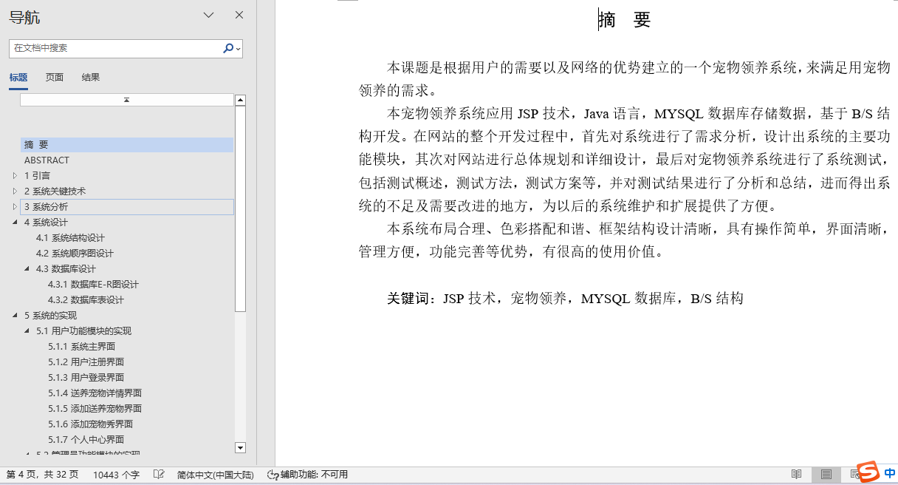
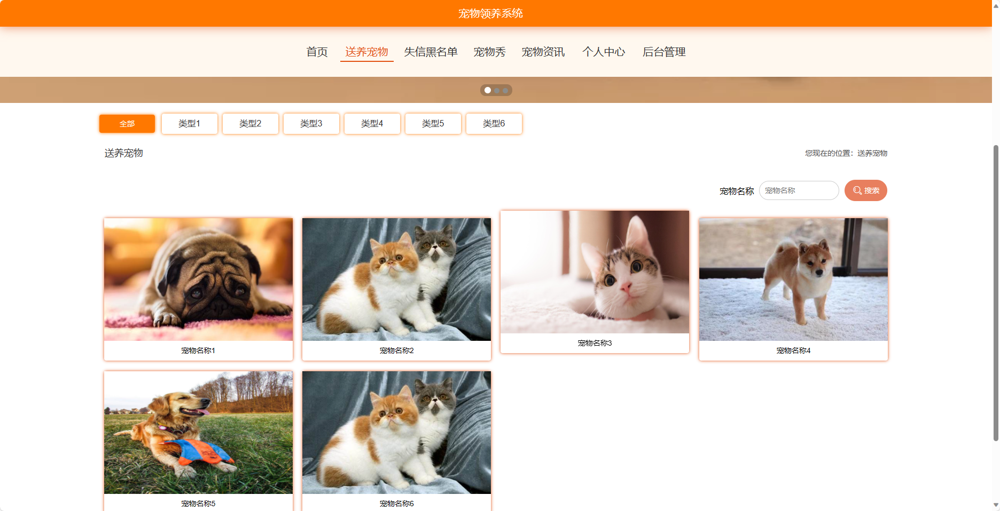
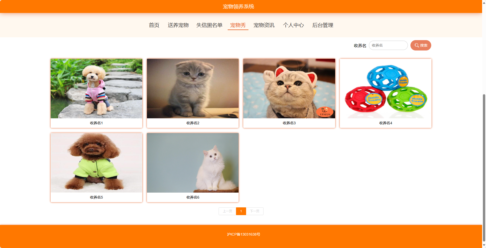
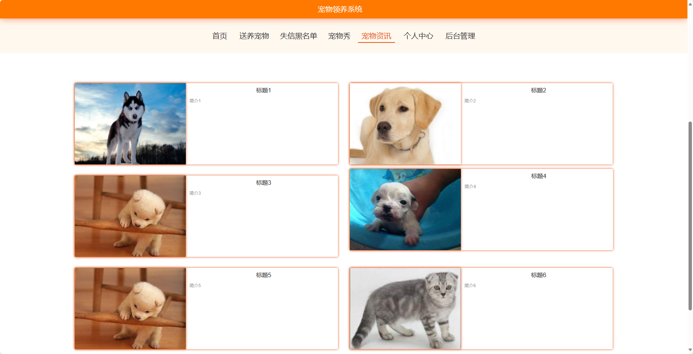
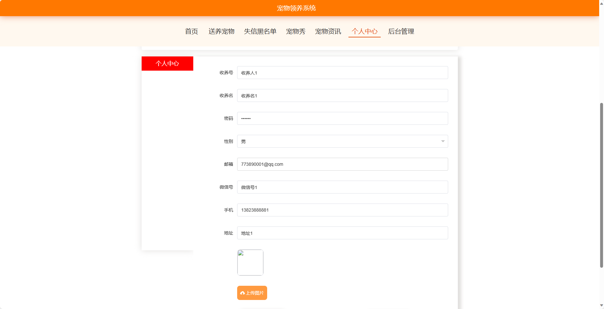
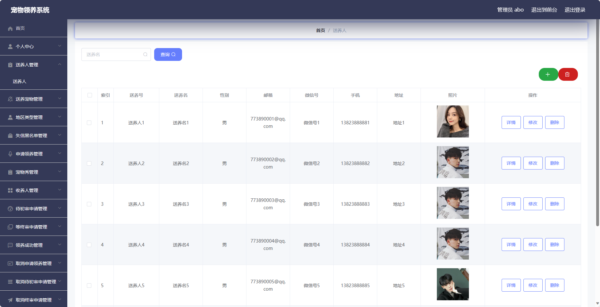
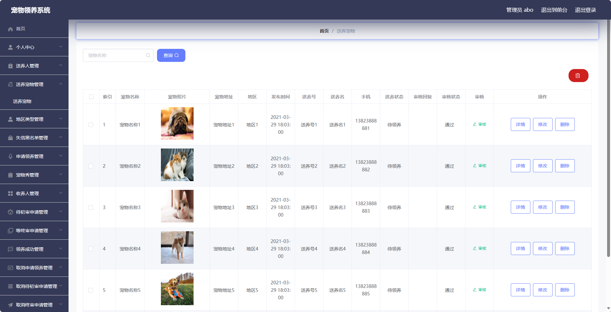
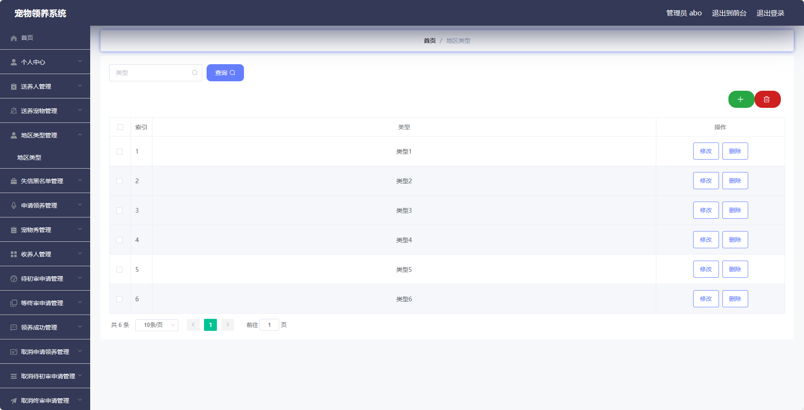

## 基于SSM框架实现的宠物领养系统(程序+报告)

###  获取sql数据库文件: 从戎源码网 (https://armycodes.com/) QQ: 386869957 QQ群: 377586148
###  所有系统地址: (https://github.com/YuLin-Coder/AllProjectCatalog) 
###  所有项目以及源代码本人均调试运行无问题 可支持远程安装部署调试、定制修改、代码讲解

## 项目介绍
基于SSM框架实现的宠物领养系统，系统包含两种角色：管理员、用户,系统分为前台和后台两大模块，主要功能如下。
前台：
1. 首页：展示宠物领养系统的主要内容和推荐信息，包括最新送养宠物、失信黑名单等，吸引用户浏览和了解宠物领养。
2. 送养宠物：展示可供领养的宠物信息，包括宠物的照片、品种、性别、年龄等，为用户提供宠物领养的选择。
3. 失信黑名单：展示失信的送养人信息，提醒用户避免与失信送养人进行交易，保障用户的权益。
4. 宠物秀：用户可以在宠物秀中发布宠物的照片和故事，与其他用户分享自己的宠物生活，增加用户之间的互动和交流。
5. 宠物资讯：提供宠物领养相关的资讯和知识，包括养宠小技巧、品种介绍、健康养护等，帮助用户了解养宠知识。
6. 个人中心：用户可以管理个人信息、发布宠物秀、查看已领养的宠物等，方便用户管理和维护个人资料。

后台-管理员：
1. 个人中心：提供管理员个人信息管理、权限管理等功能。
2. 送养人管理：管理系统中的送养人信息，包括送养人的添加、编辑、删除等操作。
3. 送养宠物管理：管理系统中的送养宠物信息，包括宠物的添加、编辑、删除等操作。
4. 地区类型管理：管理系统中的地区类型信息，方便用户按地区进行宠物领养的搜索和筛选。
5. 失信黑名单管理：管理失信的送养人信息，包括黑名单的添加、编辑、删除等操作。
6. 申请领养管理：管理用户对宠物领养的申请，包括申请的查看、审核、驳回等操作。
7. 宠物秀管理：管理用户在宠物秀中发布的宠物照片和故事，包括宠物秀的查看、删除等操作。
8. 收养人管理：管理系统中的收养人信息，包括收养人的添加、编辑、删除等操作。
9. 待初审申请管理：管理初审中的领养申请，包括申请的查看、审核、驳回等操作。
10. 等终审申请管理：管理终审中的领养申请，包括申请的查看、审核、驳回等操作。
11. 领养成功管理：管理已成功领养的宠物信息，包括领养的查看、删除等操作。
12. 取消申请领养管理：管理用户取消的领养申请，包括申请的查看、删除等操作。
13. 取消待初审申请管理：管理用户取消的待初审申请，包括申请的查看、删除等操作。
14. 取消终审申请管理：管理用户取消的终审申请，包括申请的查看、删除等操作。
15. 管理员管理：管理系统中的管理员账号，包括管理员的添加、编辑、删除等操作。
16. 系统管理：管理网站的基本配置信息，包括网站名称、Logo、版权信息等。
17. 宠物资讯：管理宠物领养系统的资讯内容，包括资讯的添加、编辑、删除等操作。
18. 轮播图管理：管理网站首页的轮播图，包括轮播图的添加、编辑、删除等操作。

## 项目技术
- 编程语言：Java
- 数据库：MySQL
- 前端技术：JSP、HTML、Jquery、Bootstrap
- 后端技术：Spring、SpringMVC、MyBatis

## 运行环境
- JDK版本：JDK1.8及以上
- 开发工具：IDEA、Ecplise、Myecplise都可以
- 数据库: MySQL5.7及以上

## 运行截图

